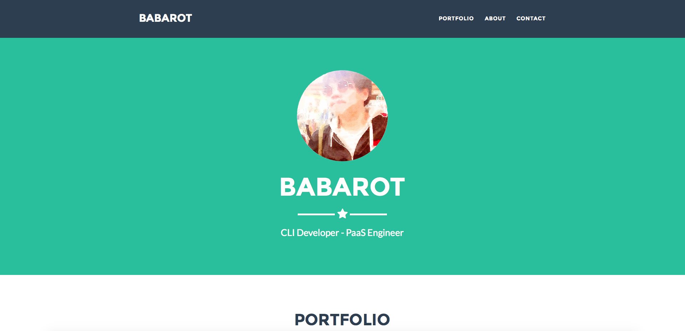

# Portfolio

Portfolio as BABAROT's history

## Description

[Freelancer](http://startbootstrap.com/template-overviews/freelancer/) is a one page freelancer portfolio theme for [Bootstrap](http://getbootstrap.com/) created by [Start Bootstrap](http://startbootstrap.com/). This theme features several content sections, a responsive portfolio grid with hover effects, full page portfolio item modals, and a working PHP contact form.

***DEMO:***

## Features

- Use [Start Bootstrap](http://startbootstrap.com/) - [Freelancer](http://startbootstrap.com/template-overviews/freelancer/)

## Usage

- [tellme.tokyo](http://tellme.tokyo)

## Installation

    $ git clone https://github.com/b4b4r07/portfolio

## Author

[@b4b4r07](https://twitter.com/b4b4r07)

## License

[MIT](https://raw.githubusercontent.com/b4b4r07/dotfiles/master/doc/LICENSE-MIT.txt)